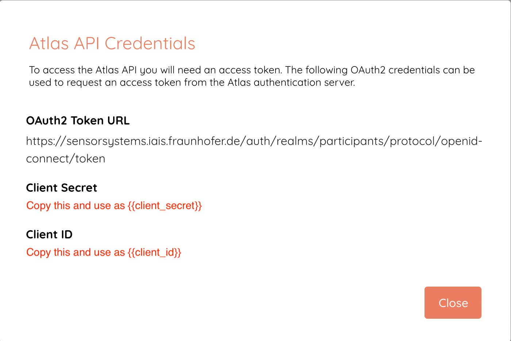

# ATLAS Registry API

The ATLAS Registry API requires an Authorization Bearer token. As a registered ATLAS participant, you obtain a client_credentials token using your assigned participant client_id and client_secret. To find your personalized credentials, go to the [ATLAS Participant Portal Settings](https://participants-portal.iais.fraunhofer.de/app/settings), and click on the **View credentials** button. You will see the following popup:


You can then retrieve the standard [OAuth2 client credentials token](https://www.rfc-editor.org/rfc/rfc6749#section-4.4) as shown in the curl example below:
```
curl -X POST 'https://sensorsystems.iais.fraunhofer.de/auth/realms/participants/protocol/openid-connect/token' \
-u '{{client_id}}}}:{{client_secret}}' \
-d 'grant_type=client_credentials'
```

With the returned access token, you may query, for instance, the list of services implementing the field_data template as follows:
```
curl -X GET 'https://sensorsystems.iais.fraunhofer.de/api/services?template_name=field_data' \
-H "Authorization: Bearer {{access_token}}"
```

The full OpenAPI Specifications of the ATLAS Registry API can be found [here](https://sensorsystems.iais.fraunhofer.de/doc/?url=https://raw.githubusercontent.com/atlasH2020/atlas-registry-api/oas)  
